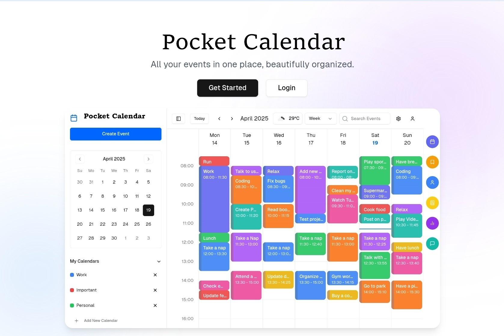

<div align="center">
  
  
# Pocket Calendar 📅

<p>

<a href="https://vercel.com/tech-art/one-calendar" target="_blank"></a>
<a href="https://github.com/azizulabedinazmi/pocket-calendar/blob/master/LICENSE" target="blank"></a>
<a href="https://github.com/azizulabedinazmi/pocket-calendar/fork" target="blank"></a>
<a href="https://github.com/azizulabedinazmi/pocket-calendar/stargazers" target="blank"></a>
<a href="https://github.com/azizulabedinazmi/pocket-calendar/issues" target="blank"></a>
<a href="https://github.com/azizulabedinazmi/pocket-calendar/pulls" target="blank"></a>

</p>

A beautifully minimal open-source calendar app to plan your week and life. ✨

<a href="https://vercel.com/new/clone?repository-url=https://github.com/azizulabedinazmi/pocket-calendar&env=NEXT_PUBLIC_BASE_URL,NEXT_PUBLIC_CLERK_PUBLISHABLE_KEY,CLERK_SECRET_KEY,OPENWEATHER_API_KEY,BLOB_READ_WRITE_TOKEN&project-name=one-calendar&repo-name=one-calendar" style="display: inline-block;"></a>
<a href="https://app.netlify.com/start/deploy?repository=https://github.com/azizulabedinazmi/pocket-calendar" style="display: inline-block;"></a>

</div>

## 🌟 What is Pocket Calendar?

**Pocket Calendar** is a privacy-first, weekly-focused, open-source calendar app, designed to help individuals and teams plan, focus, and stay in sync.

> Without *Pocket Calendar*, your schedule is scattered. With it, your week feels intentional.

## ✨ Key Features

- 🧠 **AI-Powered Scheduling** – Smart event suggestions and scheduling assistance
- 🕹 **Interactive Interface** – Drag, drop, right-click, and edit with ease
- 🔐 **Privacy First** – Your data stays local and private
- ☁️ **Cloud Sync** – Optional sync via Vercel Blob
- 🌐 **Easy Authentication** – Seamless login with Clerk
- 🌍 **Multilingual** – Supports English and Bangla
- 🧱 **Customizable** – Personalize themes and views
- 📱 **Responsive Design** – Works on all devices
- 🌤 **Weather Integration** – Real-time weather updates
- 📊 **Analytics** – Track your time and productivity
- ⌨️ **Keyboard Shortcuts** – Navigate efficiently
- 📤 **Import/Export** – Easy data portability

## 🛠 Tech Stack

- **Frontend**: 
  - Next.js 14
  - Tailwind CSS
  - shadcn/ui
  - TypeScript
- **Authentication**: Clerk
- **Storage**: 
  - LocalStorage
  - Vercel Blob
  - Misskey Drive
- **APIs**:
  - OpenWeather API
  - Groq API


## 📸 Preview




## 🚀 Getting Started

### 📋 Prerequisites

Required Versions:
- [NodeJS](https://nodejs.org) (v18 or higher)
- [Bun](https://bun.sh) (v1.2 or higher)

### ⚡ Quick Start

```bash
# Clone the repo
git clone https://github.com/azizulabedinazmi/pocket-calendar.git
cd One-Calendar

# Install dependencies
bun install

# Start the app
bun run dev
```

Then visit `http://localhost:3000`

### 🔑 Environment Variables

Copy `.env.example` to `.env` and fill in:

```env
NEXT_PUBLIC_BASE_URL=your-url

# Clerk API key (Required)
NEXT_PUBLIC_CLERK_PUBLISHABLE_KEY=your-clerk-publishable-key
CLERK_SECRET_KEY=your-clerk-secret

# Optional
GROQ_API_KEY=your-groq-api
OPENWEATHER_API_KEY=your-open-weather-api-key

# Optional, choose between Misskey and Vercel blob
MISSKEY_URL=https://misskey.io
MISSKEY_TOKEN=your-misskey-token
BLOB_READ_WRITE_TOKEN=your-vercel-blob-token
```

### 🔧 API Setup

#### 1. Groq API Setup

1. Visit [Groq Console](https://console.groq.com)
2. Log in to your account
3. Click `Create API Key`
4. Copy your API Key
5. Add to your `.env` file:
```env
GROQ_API_KEY=your-api-key
```

## 👥 The Team

This project is developed by:

<table style="width: 100%; border-collapse: collapse; margin: 2rem 0;">
  <tr style="text-align: center;">
    <td style="padding: 1rem;">
      
      <br><br>
      <a href="https://github.com/azizulabedinazmi">Azizul Abedin Azmi</a>
      <br>
      <small>Lead Developer</small>
    </td>
    <td style="padding: 1rem;">
      
      <br><br>
      <a href="https://github.com/Tanzila-Afrin">Tanzila Afrin</a>
      <br>
      <small>Developer</small>
    </td>
    <td style="padding: 1rem;">
      
      <br><br>
      <a href="https://github.com/isratjahan829">Ishrat Jahan</a>
      <br>
      <small>Developer</small>
    </td>
  </tr>
</table>

We are a team of passionate developers who love creating clean, open-source tools.

Check out our [contributors](https://github.com/azizulabedinazmi/pocket-calendar/graphs/contributors) ❤️

## 🙏 Acknowledgements

This project wouldn't be possible without these awesome services:

<div style="display: flex; justify-content: center;">
  <a href="https://vercel.com" style="text-decoration: none;"></a>
  <a href="https://clerk.com" style="text-decoration: none;"></a>
  <a href="https://groq.com" style="text-decoraion: none;"></a>
  <a href="https://openweathermap.org" style="text-decoration: none;"></a>
</div>

## 📄 License

This project is licensed under the Creative Commons Attribution 4.0 International License (CC BY 4.0).  
See the [LICENSE](./LICENSE) file for details.


## 🤝 Contributing

We welcome contributions! Please feel free to submit a Pull Request. For major changes, please open an issue first to discuss what you would like to change.

## 📞 Support

If you need help or have questions:
- Open an issue
- Join our community
- Check our documentation

## 📊 Commit History

[](https://github.com/azizulabedinazmi/pocket-calendar/graphs/commit-activity)
[](https://github.com/azizulabedinazmi/pocket-calendar/commits/main)

Recent commits:
```bash
git log --pretty=format:"%h - %s (%cr) <%an>" --graph --abbrev-commit -n 5
```

[View full commit history](https://github.com/azizulabedinazmi/pocket-calendar/commits/main)
